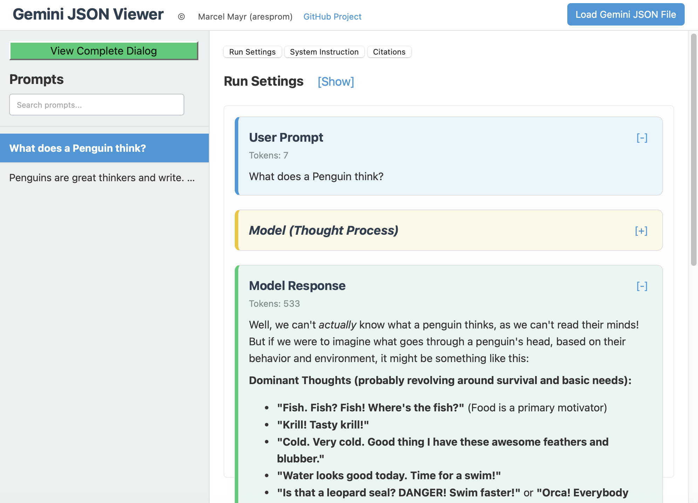

# Gemini JSON Viewer

A browser-based tool specifically designed to view and analyze structured JSON outputs exported from Google Gemini via AI Studio. When you export your Gemini conversations (often to Google Drive), this tool helps you load that JSON file and displays the interaction data (prompts, responses, "thoughts", metadata) in an organized, readable, and searchable format.

Developed by Marcel Mayr ([marcelamayr on GitHub](https://github.com/marcelamayr), [@marcelamayr on social media](https://marcelamayr.com))




## Features

*   **Load Local Files:** Easily load JSON files exported from Google Gemini / AI Studio.
*   **Prompt-Answer Sets:** Structures the output into clear prompt-answer sets.
*   **Navigation:**
    *   List of (truncated) user prompts on the left for quick navigation.
    *   Click a prompt to view its details and the corresponding model response(s).
*   **Collapsible Sections:** User prompts and model "thought processes" can be collapsed/expanded for better focus.
*   **Metadata Display:** View `runSettings`, `systemInstruction`, and `citations` in a tabbed, collapsible section at the top.
*   **Complete Dialog View:** Option to see the entire prompt-answer dialog chronologically.
*   **Search:** Filter prompts by keywords.
*   **Readability:**
    *   Clear distinction between user messages, model responses, and model thoughts.
    *   Markdown rendering for text content (bold, italics, lists, tables).
    *   Syntax highlighting for code blocks using Highlight.js.
*   **Copy Code:** "Copy" button for quickly copying code snippets from responses.
*   **Client-Side:** Runs entirely in your browser; no data is sent to any server.

## How to Use

1.  **Clone or Download:**
    ```bash
    git clone https://github.com/aresprom/Gemini-json-Viewer.git
    cd Gemini-json-Viewer
    ```
    Or download the ZIP from the repository page and extract it.

2.  **Open in Browser:**
    Open the `index.html` file in your web browser.

3.  **Load Gemini JSON Output:**
    *   In Google AI Studio, after your conversation with Gemini, use the export option (often saves to Google Drive as a JSON file).
    *   Download this JSON file to your computer.
    *   In the "Gemini JSON Viewer", click the "Load LLM Output File" button.
    *   Select the JSON file you downloaded from Google Drive.

4.  **Interact:**
    *   Browse the list of prompts on the left.
    *   Click a prompt to see its content and Gemini's response on the right.
    *   Use the "View Complete Dialog" button to see the full conversation.
    *   Expand/collapse sections as needed.
    *   Use the tabs at the top to view Run Settings, System Instruction, and Citations associated with the Gemini interaction.

## Expected JSON Input Format

This tool is tailored for the JSON structure typically exported by Google Gemini from AI Studio. A simplified example:

```json
{
  "runSettings": {
    "temperature": 0.9,
    "model": "models/gemini-1.5-pro-latest",
    // ... other settings like topP, topK, maxOutputTokens, safetySettings
  },
  "citations": [
    // { "uri": "https://example.com/source" } // If present
  ],
  "systemInstruction": {
    // "parts": [{ "text": "You are a helpful assistant for coding." }]
    // or "text": "You are a helpful assistant for coding."
    // or can be an empty object {} if no system instruction was set.
  },
  "chunkedPrompt": {
    "chunks": [
      {
        "text": "User's first prompt text...",
        "role": "user",
        "tokenCount": 25 // Optional
      },
      {
        "text": "Gemini's internal thought process for the first prompt...",
        "role": "model",
        "isThought": true, // Indicates a thought step
        "tokenCount": 50 // Optional
      },
      {
        "text": "Gemini's actual response to the first prompt...",
        "role": "model",
        "tokenCount": 150 // Optional
      },
      {
        "text": "User's second prompt text...",
        "role": "user",
        "tokenCount": 30 // Optional
      }
      // ... more chunks representing the conversation flow
    ]
  }
}
```
*   `chunkedPrompt.chunks` is the core array of interaction turns.
*   Each chunk has a `role` (`user` or `model`) and `text`.
*   Model chunks may have `isThought: true` to distinguish them.
*   `tokenCount` is displayed if present.
*   `runSettings`, `citations`, and `systemInstruction` are parsed from the top level of the JSON.

## Technologies Used

*   HTML5
*   CSS3 (Flexbox for layout)
*   JavaScript (Vanilla JS)
*   [Marked.js](https://marked.js.org/) - For Markdown parsing.
*   [DOMPurify](https://github.com/cure53/DOMPurify) - For HTML sanitization.
*   [Highlight.js](https://highlightjs.org/) - For syntax highlighting.

## Contributing

Contributions, bug reports, and feature requests are welcome! Please feel free to:
1.  Fork the repository ([https://github.com/aresprom/Gemini-json-Viewer](https://github.com/aresprom/Gemini-json-Viewer)).
2.  Create a new branch (`git checkout -b feature/YourImprovement`).
3.  Make your changes.
4.  Commit your changes (`git commit -m 'Add YourImprovement'`).
5.  Push to the branch (`git push origin feature/YourImprovement`).
6.  Open a Pull Request.

## Future Ideas / To-Do

*   More robust error handling for slight variations in the Gemini JSON structure.
*   Advanced search/filtering options (e.g., filter by "thought" steps, search within responses).
*   Option to save the current view or a processed version.
*   UI Theming (e.g., light/dark mode for the viewer).
*   Better handling of image/multimedia content if present in Gemini exports.

## License

This project is licensed under the MIT License - see the [LICENSE.md](LICENSE.md) file for details.

---

*Project by Marcel Mayr ([@ marcelamayr on GitHub](https://github.com/marcelamayr) | [marcelamayr.com](https://marcelamayr.com))*
